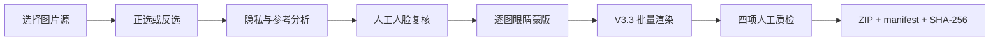

# FurColor Studio

[](LICENSE)
[](#五分钟安装并启动)

FurColor Studio 是一个面向兽装活动摄影的、本地优先 AI 批量后期工作站。它把图片源选择、正选/反选、真人脸隐私复核、参考样片驱动调色、逐图眼睛蒙版、水印、人工质检和可校验交付串成一条完整流程。

> 当前版本是摄影师辅助工具，不是无人值守的最终交付系统。真实照片只应在本地工作站处理，商业交付前必须人工复核。

## 它能做什么

- 从 JPG、JPEG、ARW 原片目录建立项目并生成本地缩略图；
- 使用正选或反选模式提前淘汰废片；
- 从同名手修参考 JPG 自动建立基础参考清单；
- 分析白平衡、主体曝光、白毛高光、黑毛细节和人脸隐私风险；
- 人工纠正“兽耳被识别人脸”等误检，并在本地自动更新记忆校准器；
- 为每张照片分别标注大小、形状、角度不同的兽装眼睛；
- 批量完成 V3.3 风格映射、眼睛增强和可选水印；
- 通过四项强制人工质检后生成 JPG、ZIP、`manifest.json` 和 SHA-256 清单。

## 五分钟安装并启动

### 前提

- Windows 10/11；
- Git；
- 一个已经存在的照片根目录，例如 `D:\Photography`。

### 新用户：复制整个代码块到 PowerShell

把示例目录替换成你自己的照片根目录，然后粘贴运行：

```powershell
$repo = Join-Path $HOME 'FurColor-Studio'
if (Test-Path -LiteralPath $repo) {
  throw "目标目录已存在：$repo。不要继续运行旧脚本，请先阅读下方“目标目录已存在”说明。"
}
git clone https://github.com/PWJCSqiushan/FurColor-Studio.git $repo
if ($LASTEXITCODE -ne 0) { throw '克隆失败，安装已停止。不要进入旧目录继续执行。' }
Set-Location -LiteralPath $repo
powershell -ExecutionPolicy Bypass -File '.\install_local.ps1' -AllowedRoots 'D:\Photography' -InstallPython -DownloadFaceModel -Launch
```

多个照片根目录使用英文分号：

```powershell
powershell -ExecutionPolicy Bypass -File '.\install_local.ps1' -AllowedRoots 'D:\Photography;E:\Events' -InstallPython -DownloadFaceModel -Launch
```

安装脚本会自动完成：

1. 寻找 Python 3.12/3.11；找不到时通过 `winget` 为当前用户安装 Python 3.12；
2. 创建独立 `.venv`；
3. 安装锁定依赖；
4. 写入仅限本机的路径白名单 `.env`；
5. 从 OpenCV 官方仓库下载固定版本 YuNet；
6. 验证模型 SHA-256；
7. 运行环境自检；
8. 打开 `http://127.0.0.1:8899`。

YuNet 目录采用 MIT License，模型来源和校验值见 [第三方声明](THIRD_PARTY_NOTICES.md)。OpenCV 官方也将该模型作为 `FaceDetectorYN` 的下载来源。[OpenCV 文档](https://docs.opencv.org/master/df/d20/classcv_1_1FaceDetectorYN.html)

### 已安装用户

以后启动只需要：

```powershell
Set-Location '.\FurColor-Studio'
& '.\run_local.ps1'
```

更新代码后重新同步依赖：

```powershell
git pull
& '.\install_local.ps1'
```

环境有问题时：

```powershell
& '.\doctor.ps1'
```

## 第一次项目：从原片到交付

### 1. 准备文件夹

推荐把原片、参考、分析、草稿和交付完全分开：

```text
D:\Photography\2026-Event\
├─ Originals\       # 相机原片，禁止覆盖
├─ References\      # 你在 Lightroom 中手修并导出的参考 JPG
├─ Analysis\        # FurColor 分析报告和配方
├─ Drafts\          # AI 修图草稿
└─ Delivery\        # 最终交付包，由程序生成
```

先在 Lightroom 中手修至少一张有代表性的照片并导出 JPG。参考 JPG 必须与对应原片同名，例如：

```text
Originals\DSC01151.ARW
References\DSC01151.jpg
```

项目表单里的“参考样片清单”可以留空，FurColor 会从同名原片/手修 JPG 自动生成基础清单。高级用户也可以选择自定义 JSON。

### 2. 新建项目

打开“新建项目”，依次填写或点击“浏览”：

| 字段 | 填什么 | 是否必需 |
|---|---|---|
| 项目名称 | 活动名或交付批次 | 是 |
| 原片目录 | `Originals` | 是 |
| 手修参考目录 | `References` | 是，至少一组同名参考 |
| 分析结果目录 | `Analysis` | 是 |
| 修图输出目录 | `Drafts` | 是 |
| 水印 PNG | 透明背景签名，可留空 | 否 |
| 参考样片清单 | 留空自动生成，或选择高级 JSON | 否 |
| 选片模式 | 正选或反选 | 是 |

系统会拒绝让分析/输出目录与原片目录重叠，避免覆盖原片或重复扫描。

### 3. 选片

- **反选模式**：默认处理全部照片，只把明确标成“废片”的照片排除。适合保留率较高的活动摄影。
- **正选模式**：只有明确标成“保留”的照片才进入后续步骤。适合大量连拍和严格精选。
- **默认**：恢复到当前模式的默认行为。

选片结果会同时控制分析、人脸复核、眼睛标注、渲染和交付，不会再弹出已淘汰的数百张照片。

### 4. 按顺序处理



不要跳步：

1. 点击“开始分析”，等待任务完成；
2. 点击“打开人脸复核”，把候选标成真人脸或兽装误检；
3. 点击“标注兽装眼睛”，为每张照片分别绘制轮廓；
4. 点击“开始渲染”，生成 AI 草稿；
5. 用图片浏览器检查草稿；
6. 完成四项质检并生成交付包。

人脸记忆至少需要 2 个 `human` 和 2 个 `fursuit` 标签才会启用；它只校准候选概率，不能替代人工隐私判断。

### 5. 四项交付质检

后端会强制确认，少一项都不能生成交付包：

- 背景真人脸、镜面和屏幕反射；
- 兽耳误打码与眼睛蒙版边缘；
- 白平衡、白毛高光、黑毛细节和主体曝光；
- 水印、胸牌、二维码和最终裁切。

交付包包含成片、ZIP 和 `manifest.json`。清单记录选片模式、人工质检声明、文件大小和逐文件 SHA-256。

## 本地隐私边界

- 完整版默认只监听 `127.0.0.1`；
- 云端 demo 没有照片上传、路径读取或处理 API；
- `.env`、照片、模型、人脸反馈、眼睛标注、数据库和交付文件均被 Git 忽略；
- 安装时配置的根目录和本机原生选择器明确选过的目录可以访问；授权记录只保存在本地，敏感系统目录始终拒绝；
- 不要使用 `git add -f` 绕过保护。

## 常见问题

### `destination path 'FurColor-Studio' already exists`

这表示克隆**没有发生**。不要忽略 `fatal` 后继续进入该目录，否则可能运行到旧版脚本。

先检查现有目录是否是真正的 Git 仓库：

```powershell
git -C "$HOME\FurColor-Studio" log -1 --oneline
git -C "$HOME\FurColor-Studio" remote -v
```

如果两条命令都正常，直接更新：

```powershell
Set-Location "$HOME\FurColor-Studio"
git pull --ff-only
if ($LASTEXITCODE -ne 0) { throw '更新失败，请停止安装并检查上方错误。' }
& '.\install_local.ps1'
```

如果提示“没有任何提交”、不是 Git 仓库或目录里只是旧文件，先备份再重新克隆：

```powershell
Set-Location $HOME
$backup = 'FurColor-Studio_backup_' + (Get-Date -Format 'yyyyMMdd_HHmmss')
Rename-Item -LiteralPath '.\FurColor-Studio' -NewName $backup
git clone https://github.com/PWJCSqiushan/FurColor-Studio.git
if ($LASTEXITCODE -ne 0) { throw "克隆失败；旧文件仍安全保存在 $backup。" }
Set-Location '.\FurColor-Studio'
```

### 提示 `Path is outside FURCOLOR_ALLOWED_ROOTS`

新版支持安全的动态多磁盘授权。请对原片、参考样片、分析、输出、水印和清单字段分别点击一次“浏览”：

1. Windows 原生选择器中选中的目录会立即授权；
2. 水印和 JSON 清单会授权其所在目录；
3. 授权记录保存在本机 `runtime/authorized_roots.json`，重启后仍有效；
4. 不同字段可以位于不同硬盘或移动硬盘；
5. `.ssh`、`.aws`、`.git`、AppData、credentials 等敏感目录不能授权。

如果希望在安装阶段一次授权多个固定根目录，也可以使用英文分号：

```powershell
& '.\install_local.ps1' -AllowedRoots 'D:\Photography;E:\Events'
```

不要把整个系统盘加入白名单；移动硬盘盘符改变后，用“浏览”重新选择即可。

### 提示找不到参考样片

确认 `References` 中至少有一张 JPG，并与 `Originals` 中的 JPG/ARW 使用相同文件名主体。

### 提示缺少 YuNet

```powershell
& '.\install_local.ps1' -DownloadFaceModel
```

### winget 误报 Python 已安装或安装卡住

如果电脑里已经有 Python 3.11/3.12，但启动器没有发现，可直接指定 `python.exe`。这只用指定的解释器创建项目独立环境，不会修改原环境：

```powershell
& '.\install_local.ps1' `
  -PythonPath 'C:\path\to\python.exe' `
  -AllowedRoots 'D:\Photography' `
  -DownloadFaceModel -Launch
```

### 8899 端口被占用

关闭旧 FurColor 窗口，或修改 `.env` 的 `FURCOLOR_PORT`。不要把本地完整版绑定到 `0.0.0.0`。

### PowerShell 阻止脚本运行

只对本次命令使用绕过策略：

```powershell
powershell -ExecutionPolicy Bypass -File '.\install_local.ps1' -AllowedRoots 'D:\Photography' -DownloadFaceModel -Launch
```

## 当前限制

- 白平衡、曝光和人脸模型仍需要跨会场继续积累验证集；
- 眼睛识别目前包含人工标注环节；
- RAW 输出是派生 JPG，不直接修改 Lightroom Catalog；
- 服务器版本是无照片的产品演示，不是多人 SaaS；
- 公开发布或商业交付的合规责任仍由操作者承担。

## 开发与测试

```powershell
py -3.12 -m venv .venv
& '.\.venv\Scripts\python.exe' -m pip install -r requirements-dev.txt
& '.\.venv\Scripts\python.exe' -m pytest -q
& '.\.venv\Scripts\python.exe' scripts\security_audit.py
```

更多文档：

- [完整操作手册](docs/USER_GUIDE.md)
- [人脸记忆模型说明](docs/MODEL_CARD.md)
- [隐私政策](PRIVACY.md)
- [腾讯云隔离部署手册](deploy/README_TENCENT.md)
- [安全报告方式](SECURITY.md)

## License

源代码采用 [Apache License 2.0](LICENSE)。用户照片、水印、活动素材、私有标注、训练数据、人脸记忆和未随仓库分发的模型权重不自动包含在该授权中。
